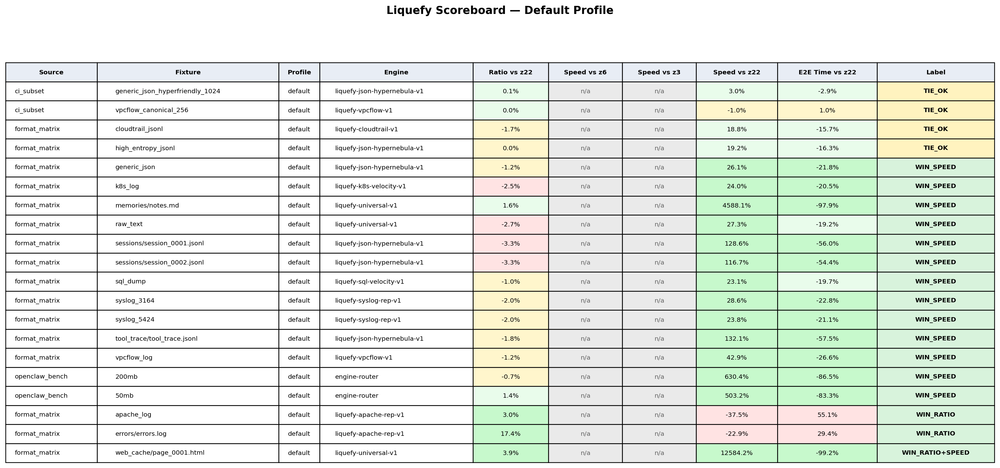

# 🧪 Liquefy: Entropy-Native Log Analytics


**Liquefy** is an enterprise-grade compression and observability engine designed for high-velocity telemetry.

---

## Trace Vault for agent runs

Agent frameworks produce trace explosions: JSONL logs, tool call outputs, HTML reports.
Trace Vault packs an entire run folder into verified `.null` archives with optional per-org encryption.
Restore is bit-perfect.

## Quick Start (30 seconds)

**macOS / Linux:**
```bash
git clone https://github.com/Parad0x-Labs/liquefy-openclaw-integration
cd liquefy-openclaw-integration
make setup
make quick DIR=~/openclaw/sessions
```

**Windows (PowerShell):**
```powershell
git clone https://github.com/Parad0x-Labs/liquefy-openclaw-integration
cd liquefy-openclaw-integration
.\setup.ps1
.venv\Scripts\python tools\tracevault_pack.py .\your\data --org default --out .\vault\output --json
```

**pip install (add to existing project):**
```bash
pip install git+https://github.com/Parad0x-Labs/liquefy-openclaw-integration.git
pip install "liquefy-openclaw[all] @ git+https://github.com/Parad0x-Labs/liquefy-openclaw-integration.git"  # with all extras
```

Optional extras: `vision` (Pillow), `cloud` (boto3), `anchor` (solders), `api` (FastAPI server), `all` (everything).

**Docker:**
```bash
git clone https://github.com/Parad0x-Labs/liquefy-openclaw-integration
cd liquefy-openclaw-integration
docker compose run liquefy tools/tracevault_pack.py ./data --org default --out ./vault/output --json
```

See `AGENTS.md` for presets, full commands, and agent integration.

### Benchmark snapshot (default profile, post-fix)

Default profile is the production-oriented baseline. The scoreboard below is the current headline benchmark view (green/yellow/red = win/tie/loss by repo policy bands).



Scoreboard source of truth:
- `./bench/results/SCOREBOARD.csv`
- `./bench/results/SCOREBOARD_SUMMARY.md`

Current scoreboard summary (latest committed scoreboard artifact):
- `WIN_SPEED`: `16`
- `WIN_RATIO`: `7`
- `WIN_RATIO+SPEED`: `2`
- `TIE_OK`: `17`
- `FAIL`: `0`

This scoreboard combines:
- realistic format matrix rows
- CI subset regression rows
- OpenClaw benchmark rows (50MB/200MB)

Note: engine-core tuning has moved since some previously generated benchmark artifacts. Regenerate `SCOREBOARD.csv` / `SCOREBOARD_SUMMARY.md` and the scoreboard image after major engine changes before publishing fresh numeric claims.

### Smoke fixtures (routing sanity only)

| Fixture | Purpose | Expected route |
|---|---|---|
| `apache.log` | Apache log routing smoke | `liquefy-apache-rep-v1` |
| `cloudtrail.jsonl` | CloudTrail/JSONL routing smoke | `liquefy-cloudtrail-v1` or JSON family engine |
| `dump.sql` | SQL routing smoke | `liquefy-sql-velocity-v1` |
| `sample.json` | JSON routing smoke | JSON family engine (`hypernebula` / cascade candidate) |
| `syslog_3164.log` | RFC3164 syslog routing smoke | `liquefy-syslog-rep-v1` |
| `syslog_5424.log` | RFC5424 syslog routing smoke | `liquefy-syslog-rep-v1` |
| `vpcflow.log` | VPC flow routing smoke | `liquefy-vpcflow-v1` |

These tiny fixtures are routing/correctness smoke examples only. Do not use them as headline performance numbers.

### Quick start

```bash
# One-command local install (macOS/Linux, Apple Silicon-friendly source path)
./install.sh

# Activate the local environment
source .venv/bin/activate

# Pack a run folder
python tools/tracevault_pack.py ./runs/latest --org dev --out ./vault/latest

# Restore
python tools/tracevault_restore.py ./vault/latest --out ./restored/latest
```

### Runtime checks (binary-friendly)

```bash
# Build/runtime metadata
python tools/tracevault_pack.py --version --json

# Crypto + zstd + policy smoke checks
python tools/liquefy_openclaw.py --self-test --json

# Environment checks (paths, perms, secret requirements)
python tools/tracevault_restore.py --doctor --json
```

All three wrappers support `--version`, `--self-test`, and `--doctor` (machine-readable with `--json`).

### Framework-Agnostic — Works With Any Agent Stack

Liquefy doesn't care which framework runs your agents. If it produces files, we compress, verify, and audit them.

| Framework | Status | Notes |
|---|---|---|
| **OpenClaw** | Native plugin + skill pack | Full integration, benchmarked |
| **NanoClaw** | Works out of the box | Container output → `make quick` |
| **LangChain** | Works out of the box | JSONL/JSON traces routed automatically |
| **CrewAI** | Works out of the box | Agent run folders pack directly |
| **Claude Agent SDK** | Works out of the box | Structured JSON output, ideal match |
| **Custom / scripts** | Works out of the box | Any directory with logs/data |

```bash
# At end of any agent run, pack the output folder
python tools/tracevault_pack.py ./agent-output --org dev --out ./vault/latest
```

### One-command OpenClaw workspace pack

```bash
# Fastest OpenClaw source install + self-test + first safe scan (macOS/Linux)
git clone https://github.com/Parad0x-Labs/liquefy-openclaw-integration.git && \
  cd liquefy-openclaw-integration && \
  ./install.sh && \
  ./.venv/bin/python tools/liquefy_openclaw.py --self-test --json && \
  ./.venv/bin/python tools/liquefy_openclaw.py --workspace ~/.openclaw --out ./openclaw-vault --json

# Then (optional) use the bundled wrapper after install:
# Whole-workspace pack with built-in credential denylist + report
./liquefy openclaw --workspace ~/.openclaw --out ./openclaw-vault --verify-mode full --workers 8
```

This command writes `OPENCLAW_LIQUEFY_REPORT.md` inside the vault output folder and keeps compressed search available via:

```bash
./liquefy search ./openclaw-vault --query "trace_id"
```

### Policy audit & safe overrides (OpenClaw + TraceVault)

```bash
# Inspect the active effective policy before packing (human-readable)
python tools/liquefy_openclaw.py --workspace ~/.openclaw --out ./openclaw-vault \
  --print-effective-policy

# Explain why a path is allowed/denied (JSON, plugin-friendly)
python tools/liquefy_openclaw.py --workspace ~/.openclaw --out ./openclaw-vault \
  --json --explain credentials/api.pem

# Use a shared policy file for TraceVault scans
python tools/tracevault_pack.py ./runs/latest --org dev --out ./vault/latest \
  --scan-only --policy ./policies/balanced.yml --json

# Explicit risky override (loud, audited, recorded in JSON/report)
python tools/liquefy_openclaw.py --workspace ~/.openclaw --out ./openclaw-vault \
  --json --include-secrets "I UNDERSTAND THIS MAY LEAK SECRETS"
```

Policy examples:
- `./policies/strict.yml`
- `./policies/balanced.yml`
- `./policies/demo_risky.yml`

Security docs:
- `./docs/policy.md`
- `./docs/sdk.md`
- `./SECURITY.md`
- `./THREAT_MODEL.md`

JSON schemas (plugin / SDK integration contracts):
- `./schemas/liquefy.tracevault.cli.v1.json`
- `./schemas/liquefy.tracevault.restore.cli.v1.json`
- `./schemas/liquefy.openclaw.cli.v1.json`
- `./schemas/liquefy.cli.v1.json`

Restore safety:
- `tracevault_restore.py` defaults to a `2 GiB` total output cap to prevent disk-filling accidents.
- Use `--max-output-bytes 0` to disable the cap (power-user override).
- This protects local machines/CI runners when restoring untrusted or shared vaults.

Status artifacts (generated):
- `./bench/results/LIQUEFY_STATUS_REPORT.md`
- `./bench/results/LIQUEFY_STATUS_REPORT.json`

Free for personal/private, nonprofit, and academic use (including production in those contexts). Commercial / for-profit use requires a [license](./COMMERCIAL_LICENSE.md), including monetized hosted/API offerings and paid wrappers built on Liquefy.

**Decoder is always available.** Decompression and verification never require a license, a running service, or access to this repo. Archives are self-contained. Your data is never hostage.

Not affiliated with OpenClaw, NanoClaw, or any agent framework vendor. See [docs/TRACE_VAULT.md](./docs/TRACE_VAULT.md) for details.

### OpenClaw integration (1 minute)

```bash
# Legacy agent-scoped workflow (still supported)
python tools/openclaw_tracevault.py list
python tools/openclaw_tracevault.py pack --agent <agentId> --out ./vault/openclaw/<agentId>
python tools/openclaw_tracevault.py pack --agent <agentId> --since-days 7 --out ./vault/openclaw/<agentId>
```

## ⚖️ License
Liquefy is licensed under the **Business Source License 1.1 (BUSL-1.1)**:
- **Free use (including production)**: Personal/private non-commercial, nonprofit, and academic/educational/research use are permitted under the Additional Use Grant (see `LICENSE`).
- **Commercial / for-profit use**: Requires a commercial license from Parad0x Labs (including internal company use, SaaS/hosted services, embedding, and paid-client work). See [COMMERCIAL_LICENSE.md](./COMMERCIAL_LICENSE.md).
- **Change Date**: 2028-02-22 — after this date, automatically converts to **GPL-2.0-or-later**.
- **Decode-only recovery**: Always free. No license required to decompress or verify `.null` archives.

---

## 🎖️ Enterprise Certification
Liquefy is certified for **100% bit-perfect restoration**. Our comprehensive test suite covers 24 engine combinations and validates integrity against the Golden-Rule standard.

*   [**View Enterprise Evaluation Notes**](./docs/enterprise-evaluation.md)
*   [**View Technical Specification**](./docs/technical-specification.md)

---

## 🛠️ Decoder CLI (Offline Recovery)

The Liquefy decoder CLI/appliance path provides offline data recovery and verification for production `.null` archives in hardened environments.

**This repository + Docker is sufficient for offline decompression and verification. No license is required for decode-only recovery.**

### One-Command Installation
```bash
# Fastest source install (macOS/Linux, Apple Silicon-friendly)
git clone https://github.com/Parad0x-Labs/liquefy-openclaw-integration.git && cd liquefy-openclaw-integration && ./install.sh

# Equivalent step-by-step:
git clone https://github.com/Parad0x-Labs/liquefy-openclaw-integration.git
cd liquefy-openclaw-integration
# Source install (works today)
./install.sh

# Or use the decoder wrapper directly (Docker-backed path for decode/verify)
chmod +x ./liquefy
```

### Verify Downloads (checksums)

Release binaries include `SHA256SUMS.txt`. Verify downloads before running them:

- See `./docs/VERIFY_DOWNLOADS.md` for macOS/Linux/Windows commands.
- The current release workflow generates `SHA256SUMS.txt` automatically in GitHub Releases.

### Usage (Linux/macOS)
```bash
# Decompress a production archive
./liquefy decompress archive.null restored.log

# Verify bit-perfect integrity
./liquefy verify archive.null
```

### Windows (PowerShell)
```powershell
.\liquefy decompress archive.null restored.log
```

---

## 📂 Complete Source-Available Engine

Unlike our previous black-box releases, this repository now contains the **complete source code** for the Liquefy compression engines, orchestrator, and safety valves.

You can inspect, compile, and run the entire source-available stack locally:

### Using the Source-Available Engines

See the `api/engines` folder for the Python implementations. You can run compressions directly without Docker for non-production use under the BUSL-1.1 license terms.

### OpenClaw Plugin Wrapper (Node.js scaffold)

A Node.js OpenClaw plugin wrapper scaffold is included under:

- `./plugins/openclaw-plugin`

It exposes `liquefy_scan` (read-only) and `liquefy_pack_apply` (optional) by shelling out to the Liquefy CLI JSON contracts.
It also includes a ClawHub/OpenClaw skill pack scaffold under:

- `./plugins/openclaw-plugin/skills/liquefy-openclaw/SKILL.md`

Publish/install trust notes (pinned plugin versions, checksums, safe defaults):

- `./docs/openclaw-plugin-publish.md`

### DNA x402 Payment Bridge Plugin

[DNA](https://github.com/Parad0x-Labs/dna-x402) is our open-source payment rail for AI agents (x402 protocol on Solana). The DNA payment bridge plugin archives micropayment audit logs and cryptographic receipts into Liquefy `.null` vaults.

- `./plugins/dna-payment`

**What it does:**
- Exports DNA payment audit events as Liquefy telemetry (NDJSON)
- Converts signed payment receipts into verifiable proof artifacts
- Packs everything into `.null` vaults with bit-perfect verification

**Quick usage:**

```bash
# Export DNA payment data to a Liquefy-ready directory
python plugins/dna-payment/dna_bridge.py export \
  --server http://localhost:8080 \
  --out ./vault-staging/dna-payments

# Pack into a .null vault
python tools/tracevault_pack.py ./vault-staging/dna-payments \
  --org dna --out ./vault/dna-payments --json
```

DNA can also run as a live sidecar, streaming payment events directly into vault directories in real-time. See [`plugins/dna-payment/README.md`](./plugins/dna-payment/README.md) for full integration docs.

---

### Vision — Screenshot Dedup (Engine #24)

AI agents capture redundant screenshots (10-50 shots of the same static window). The Vision engine deduplicates near-identical images using perceptual hashing, storing only unique frames.

```bash
make vision-scan DIR=./agent-screenshots         # Report dedup potential
make vision-pack DIR=./agent-screenshots          # Pack into VSNX vault (deduplicated)
make vision-restore SRC=./vault/vision.vsnx       # Restore all images from vault
make vision-stats SRC=./vault/vision.vsnx         # Show dedup stats
```

- **Perceptual hashing** — 8x8 average-hash (aHash) detects visually identical frames even with minor pixel differences
- **Exact dedup** — SHA-256 catches byte-identical files (zero-cost)
- **VSNX container** — compact binary format with manifest + compressed unique blobs
- Install Pillow for full perceptual mode: `pip install Pillow`

### Compliance Reports (One-Click Audit)

Generate human-readable HTML compliance reports from the tamper-proof audit chain. Designed for CTOs and compliance officers who need proof without running terminal commands.

```bash
make compliance VAULT=./vault ORG=acme TITLE="Q1 Audit"  # HTML compliance report
make compliance-verify VAULT=./vault                       # Pass/fail integrity check
make compliance-timeline VAULT=./vault                     # Chronological event timeline
```

- **Chain verification** — SHA-256 hash chain integrity check with per-entry validation
- **Event breakdown** — counts, types, timestamps, and activity summaries
- **Dark-mode HTML** — clean, professional reports ready for auditors

### Cloud Sync (S3 / R2 / MinIO)

Sync encrypted vaults to any S3-compatible storage. The cloud provider sees only opaque blobs — "sovereign" means encrypted everywhere, not just local.

```bash
make cloud-push VAULT=./vault BUCKET=my-backups           # Incremental push
make cloud-pull VAULT=./vault BUCKET=my-backups           # Restore from cloud
make cloud-status VAULT=./vault BUCKET=my-backups         # Compare local vs remote
make cloud-verify VAULT=./vault BUCKET=my-backups         # Verify remote integrity
```

- **Incremental sync** — only uploads changed/new vaults (SHA-256 manifest tracking)
- **Any S3-compatible** — AWS S3, Cloudflare R2, MinIO, etc.
- **Integrity verification** — confirms remote files match local hashes
- Install boto3: `pip install boto3`

### Policy Enforcer (Active Kill Switch)

Three levels: audit (report), enforce (block), kill (halt signal + SIGTERM).

```bash
make policy-audit DIR=./agent-output      # Report violations
make policy-enforce DIR=./agent-output    # Block on critical/high
make policy-kill DIR=./agent-output       # Write halt signal to stop agent
```

- **Secret detection** — API keys, tokens, AWS creds, private keys, JWTs
- **Forbidden files** — `.exe`, `.dll`, `.vbs`, executables blocked
- **Watch mode** — continuous monitoring with auto-halt on critical violations
- **Hardened halt** — HMAC-signed signals, nonce replay protection, TTL expiry, process group kill
- **Custom policies** — configurable size limits, extensions, patterns

### Content-Addressed Storage (Cross-Run Dedup)

Blobs stored once by SHA-256, vaults become lightweight manifests over shared blobs:

```bash
make cas-ingest DIR=./agent-run-1    # First run: stores all blobs
make cas-ingest DIR=./agent-run-2    # Second run: only new blobs stored
make cas-status                      # Show dedup savings
make cas-gc                          # Clean orphan blobs
```

- Same screenshots, prompts, configs across runs are never stored twice
- Sharded blob directory (first 2 chars) for filesystem friendliness
- Manifest-based restore: `make cas-restore MANIFEST=<id> OUT=./restored`

### Unified CLI

One entry point for all operations:

```bash
liquefy pack       --workspace ~/.openclaw --out ./vault --apply
liquefy restore    ./vault/run_001 --out ./restored
liquefy policy     audit --dir ./agent-output --json
liquefy safe-run   --workspace ~/.openclaw --cmd "openclaw run"
liquefy cas        ingest --dir ./agent-output
liquefy tokens     scan --dir ./agent-output
liquefy telemetry  push --webhook https://my-siem/api
liquefy events     emit --agent-id a1 --session-id s1 --event model_call
liquefy guard      save --dir .
liquefy anchor     --vault-dir ./vault
```

### Agent Event Schema

Structured traces with parent/child span trees:

```bash
make event-emit AGENT_ID=a1 SESSION_ID=s1 EVENT=model_call MODEL=gpt-4o
make event-query SESSION_ID=s1
make event-spans SESSION_ID=s1       # parent->child span tree
make event-stats SESSION_ID=s1       # tokens, cost, duplicate prompts
```

- `agent_id`, `session_id`, `span_id`, `parent_span_id`, `trace_id`
- Model call metadata: model, tokens, cost, duration
- Tool call I/O refs, prompt hash, context hash
- Error/retry/escalation markers
- Duplicate prompt detection in stats

### Safe Run (Automated Rollback + Cost Cap + Watchdog)

Wrap agent execution with snapshot + auto-restore on violations:

```bash
make safe-run WORKSPACE=~/.openclaw CMD="openclaw run" SENTINELS=SOUL.md,HEARTBEAT.md

# With cost cap and heartbeat watchdog
python tools/liquefy_safe_run.py \
    --workspace ~/.openclaw --cmd "python agent.py" \
    --max-cost 5.00 --heartbeat --sentinels SOUL.md --json
```

- **Snapshot** workspace before run, **restore** if policy violation or crash
- **Token cost cap** (`--max-cost`) — auto-rollback if agent burns more than your USD limit (prevents economic DoS)
- **Dead Man's Switch** (`--heartbeat`) — writes `.liquefy-heartbeat` every 5s; agent or watcher self-halts if monitoring dies
- **Sentinel monitoring** — detect tampering of SOUL.md, HEARTBEAT.md, auth-profiles.json
- **Docker jail** pattern documented for host-isolated agent execution

### Multi-Agent Chain of Custody

Trace prompts across agent handoffs (researcher -> executor -> verifier):

```bash
python tools/liquefy_openclaw.py --workspace ~/.openclaw --out ./vault --apply --trace-id "task-42"
python tools/liquefy_policy_enforcer.py enforce --dir ./vault --trace-id "task-42" --json
```

- `--trace-id` or `LIQUEFY_TRACE_ID` env var on all tools
- Logged in audit chain, written to vault, forwarded to SIEM

### Telemetry Forwarder (SIEM Streaming)

Push audit events to Splunk, Datadog, ELK, Slack, or any SIEM in real-time.

```bash
make telemetry-push WEBHOOK=https://splunk:8088/services/collector
make telemetry-stream SYSLOG=10.0.0.1:514 INTERVAL=10
make telemetry-test FILE=/var/log/liquefy.jsonl
```

- **Webhook** — HTTP POST JSON to any endpoint
- **Syslog** — RFC 5424 UDP/TCP for enterprise log collectors
- **Cursor-based** — only forwards new events, no duplicates

### Token Ledger [EXPERIMENTAL]

Track where your tokens go, set budgets, and catch waste before the bill arrives.

```bash
make token-scan  DIR=./agent-output                   # Extract usage from logs
make token-budget ORG=acme DAILY=500000               # Set daily limit
make token-report ORG=acme PERIOD=today               # Usage breakdown
make token-audit DIR=./agent-output                   # Find waste
```

- **Multi-provider** — parses OpenAI, Anthropic, LangChain, generic JSONL
- **Waste detection** — duplicate prompts, oversized context, expensive models for trivial tasks
- **Budgets** — daily/monthly token + cost limits with warnings
- **Auto-detect** — flags unknown models and model switches with fix commands
- **28 built-in models** — GPT-5, Claude 4.6, Gemini 2.0, DeepSeek R1, etc. User-expandable via `make token-models --add`
- **Experimental** — cost estimates are approximate; use provider billing for exact amounts

### Config Guard (Update Protection)

Framework update overwrites your configs? Not anymore.

```bash
make guard-save DIR=./my-agent LABEL="pre-v2.0"    # Snapshot before update
# ...run your update...
make guard-diff DIR=./my-agent                       # See what changed
make guard-restore DIR=./my-agent                    # Restore your customizations
```

- **Auto-detects** configs, skills, prompts, env files, Dockerfiles, Makefiles
- **Conflict-safe** — saves `.update-backup` copies when both you and the update changed a file
- **Framework-agnostic** — works with any project directory
- **Dry-run** mode to preview without touching anything

### On-Chain Vault Anchoring (Solana)

Anchor vault integrity proofs on Solana. ~80 bytes of hashes go on-chain via SPL Memo — no data, no keys, just a fingerprint that proves your vault existed in a specific state at a specific time. Anyone with a Solana explorer can verify it.

```bash
make vault-proof  VAULT=./vault                   # Compute proof (free, offline)
make vault-anchor VAULT=./vault KEYPAIR=~/.config/solana/id.json  # Anchor on Solana
make vault-verify VAULT=./vault                   # Verify vault vs anchor
make vault-show   PROOF=./vault/.anchor-proof.json  # Display proof
```

- **Cost:** ~0.000005 SOL per anchor
- **What's anchored:** vault file hash, audit chain tip hash, encryption key fingerprint
- **What's NOT anchored:** your data, your key, anything readable
- Install solders + httpx: `pip install solders httpx` (proof generation works without them)

---

## 🛡️ Execution & Maintenance Policy

The decoder CLI/appliance path is built for **enterprise-grade reliability**. To ensure secure conduction and data sovereignty, the following policies are enforced:

1.  **Maintenance & Compatibility:** This build is optimized for archives generated by v3.1 cores. While decompression is never paywalled, newer archive formats may require the latest signed build of the SDK.
2.  **Execution Safety:** To prevent runtime instability, the appliance requires a standard execution environment. If unauthorized runtime hooks (e.g. `LD_PRELOAD`) are detected, the appliance fails closed.
3.  **Data Sovereignty:** All operations happen locally. No data is ever transmitted back to Parad0x Labs.

## 📊 Benchmark Notes (Read This Before Comparing)

- Liquefy results are **profile- and workload-dependent** (`default`, `ratio`, `speed`).
- `default` / `ratio` profiles are judged against zstd high-compression behavior (zstd-22 class), not zstd speed-first settings.
- `speed` profile is the fair comparison point for zstd-3/zstd-6 throughput claims.
- See the committed visuals for a public-safe summary:
  - `./liquefy_scoreboard_default.png`
  - `./liquefy_vs_zstd_openclaw_50_200.png`

---

## 🏢 Commercial License

For production use of the Licensed Work, Parad0x Labs provides a **Commercial License**.

*   **Email:** [hello@parad0xlabs.com](mailto:hello@parad0xlabs.com)
*   **X (Twitter):** [@Parad0x_Labs](https://x.com/Parad0x_Labs)

© 2026 Parad0x Labs. 🚀
