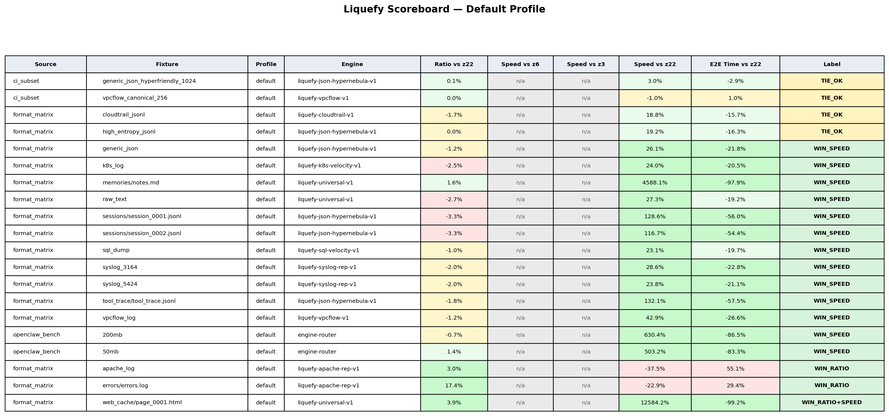

# openclaw-skills 🧩 — Parad0x Labs skills for OpenClaw & every *claw agent


One home for Parad0x Labs' agent skills — payments, context compression, and
workspace guardrails — for **OpenClaw and every *claw-family runtime** that
speaks the same skill format.

## The catalog

| Skill | What it does | Standalone? | Pairs with | Install |
|---|---|---|---|---|
| [`x402-pay`](./skills/x402-pay) | Your agent **pays** x402-gated APIs/agents in USDC on Solana — BYO signer, never holds a key, devnet-default, hard spend cap | ✅ works against any x402 endpoint | `x402-gate` (the selling side) | from source — npm publish pending |
| [`x402-gate`](./skills/x402-gate) | **Charge** other agents per call — mint a 402 challenge, verify (optionally on-chain-confirmed), serve; funds land in your own wallet | ✅ any x402 client can pay it | `x402-pay` (the buying side) | from source — npm publish pending |
| [`context-capsule`](./skills/context-capsule) | Compresses long session history before the model call (99.3% token savings / 90% recovery, measured by the [public bench](https://github.com/Parad0x-Labs/dna-x402/tree/main/packages/context-capsule)) — no network, no chain | ✅ fully self-contained | everything — orthogonal | `npm i @parad0x_labs/openclaw-context-capsule` |
| [`liquefy-openclaw`](./skills/liquefy-openclaw) | Skill pack for the vault appliance: scan/pack flows, guarded runs, context gate, replay blocking, restore | needs the vault appliance below | vault appliance | copy skill dir / ClawHub |
| [`liquefy_archive`](./skills/liquefy_archive) | One-click compression, redaction & vault archival of OpenClaw workspaces | needs the vault appliance below | vault appliance | skill.json install |
| [`liquefy_token_guard`](./skills/liquefy_token_guard) | Token usage scan, waste audit, and budget guard for agent workspaces | needs the vault appliance below | vault appliance | skill.json install |

Plus the **resident module**: the [vault appliance](#the-vault-appliance-resident-module)
(Python, repo root) — trace vaults, policy enforcement, flight recorder,
state/history guards. The three liquefy skills above are its front-ends.

**Start here →** [**The Web0 agent loop**](./docs/WEB0_AGENT_LOOP.md): register a
.null name, publish a compressed page to permanent storage, put your payment
endpoint on-chain, and charge other agents per call — each step labeled with
its real, verified status.

## The modularity contract

Every entry under `skills/` is a **self-contained module**:

- **No imports across skills.** A skill never references a sibling's code —
  shared constants are vendored. Updating or deleting one skill cannot break
  another.
- **Own version, own README, own SKILL.md.** Each module documents what it
  does, whether it works standalone, and what it pairs with.
- **Own CI lane.** Workflows are path-filtered to `skills/<name>/**` — a change
  to one skill builds and tests only that skill.
- **Trust model up front.** Skills that can touch money state it bluntly
  (custody, caps, network defaults) before the install instructions.

> **Status: Public Beta.** Everything here is MIT and **unaudited — no external
> audit has been completed or scheduled.** Money-touching skills are
> non-custodial by design, devnet-first, and capped; read each skill's trust
> model before pointing it at real funds.

### How this fits the Parad0x stack

Parad0x Labs builds Web0 on Solana — money and agents that settle themselves. **You are here: 🧩 Skills — the OpenClaw-facing distribution of the stack below.**

| Layer | Repo | Does |
|---|---|---|
| 💸 Payments | [dna-x402](https://github.com/Parad0x-Labs/dna-x402) | x402 rail: quote → pay → verify → receipt → anchor |
| 🛠️ Build | [dna-x402-builders](https://github.com/Parad0x-Labs/dna-x402-builders) | Hosted kit: turn any API/bot into a paid agent |
| 🕶️ Privacy | [Dark-Null-Protocol](https://github.com/Parad0x-Labs/Dark-Null-Protocol) | Groth16 privacy settlement, published proofs |
| 🗜️ Data | [liquefy](https://github.com/Parad0x-Labs/liquefy) | Columnar compression that beats Zstd |
| 🛡️ Audit | [liquefy-openclaw-integration](https://github.com/Parad0x-Labs/liquefy-openclaw-integration) | Flight recorder: 24 engines + Solana-anchored audit trails |
| 🎬 Media | [nebula-media](https://github.com/Parad0x-Labs/nebula-media) | Proof-carrying media compression — scene-aware + on-chain receipts |
| 🧠 Local AI | [nulla-local](https://github.com/Parad0x-Labs/nulla-local) | Local-first agent runtime — your machine, your memory |

**See it live** (a consumer app running on these rails): **[parad0xlabs.com](https://parad0xlabs.com)**

## LLM / Agent Quick Parse

```yaml
product: openclaw-skills
category: modular agent skills for OpenClaw and *claw-family runtimes
skills:
  x402-pay: pay x402-gated APIs on Solana (BYO signer, capped, devnet-default)
  x402-gate: charge other agents per call (no custody, on-chain verify option)
  context-capsule: compress long session history (no network, no chain)
  liquefy-openclaw: guardrail flows for the vault appliance
  liquefy_archive: one-click workspace vaulting
  liquefy_token_guard: token waste audit + budgets
resident_module: vault appliance (Python, repo root — trace vaults, policy, flight recorder)
contract: skills are self-contained — no cross-skill imports, path-filtered CI
entrypoints:
  catalog: ./README.md
  skills: ./skills/
  agent_guide: ./AGENTS.md
  stack_map: ./docs/PARADOX_STACK.md
not_for:
  - the x402 rail itself (see dna-x402)
  - privacy settlement protocol (see Dark-Null-Protocol)
related_repos:
  payment_rail: https://github.com/Parad0x-Labs/dna-x402
  privacy_settlement: https://github.com/Parad0x-Labs/Dark-Null-Protocol
  audit_layer: https://github.com/Parad0x-Labs/liquefy-openclaw-integration
```

---

## The vault appliance (resident module)

The rest of this README documents the repo's largest module: the **vault
appliance** — an entropy-native compression + security layer for agent
infrastructure. Trace vaults, bit-perfect verification, tamper-evident audit
trails, policy enforcement, and Solana anchoring. The `liquefy-*` skills in the
catalog are thin front-ends over these tools.

### Why teams deploy Liquefy

- **24 compression engines** — domain-aware compressors for JSON, logs, SQL, network captures, images, and more. Not a wrapper around zstd — each engine exploits the structure of its data type for ratios generic tools can't touch.
- **Bit-perfect verification (MRTV)** — every compress/decompress cycle is verified. Zero silent corruption. What goes in comes out identical, provably.
- **Cryptographic Flight Recorder** — SHA-256 hash-chained audit trails with on-chain anchoring (Solana). Automatic secret redaction. One-click HTML forensic reports. When the auditor, regulator, or lawyer arrives, you have mathematically verifiable proof — not just logs.
- **Active agent protection** — policy enforcement with kill switches, context-gated runs, token budget caps, sentinel file monitoring, replay blocking, and automated rollback. If an agent goes rogue or keeps re-running the same expensive context bundle, Liquefy halts it before damage is done.
- **One layer for all frameworks** — OpenClaw, NanoClaw, LangChain, CrewAI, Claude Agent SDK, or any agent that touches the filesystem.

---

## Trace Vault for agent runs

Agent frameworks produce trace explosions: JSONL logs, tool call outputs, HTML reports.
Trace Vault packs an entire run folder into verified `.null` archives with optional per-org encryption.
Restore is bit-perfect.

## Quick Start (30 seconds)

**macOS / Linux:**
```bash
git clone https://github.com/Parad0x-Labs/openclaw-skills
cd openclaw-skills
make setup
make quick DIR=~/openclaw/sessions
```

**Windows (PowerShell):**
```powershell
git clone https://github.com/Parad0x-Labs/openclaw-skills
cd openclaw-skills
.\setup.ps1
.venv\Scripts\python tools\tracevault_pack.py .\your\data --org default --out .\vault\output --json
```

**pip install (add to existing project):**
```bash
pip install git+https://github.com/Parad0x-Labs/openclaw-skills.git
pip install "liquefy-openclaw[all] @ git+https://github.com/Parad0x-Labs/openclaw-skills.git"  # with all extras
```

Optional extras: `vision` (Pillow), `cloud` (boto3), `anchor` (solders), `api` (FastAPI server), `all` (everything).

**Docker:**
```bash
git clone https://github.com/Parad0x-Labs/openclaw-skills
cd openclaw-skills
docker compose run liquefy tools/tracevault_pack.py ./data --org default --out ./vault/output --json
```

See `AGENTS.md` for presets, full commands, and agent integration.

### Benchmark snapshot (default profile, post-fix)

Default profile is the production-oriented baseline. The scoreboard below is the current headline benchmark view (green/yellow/red = win/tie/loss by repo policy bands).



Scoreboard source of truth (generated locally by the bench runner — `bench/results/`
is gitignored, so these files are **not** present in a fresh clone; regenerate them
with the bench scripts before quoting numbers):
- `./bench/results/SCOREBOARD.csv`
- `./bench/results/SCOREBOARD_SUMMARY.md`

Scoreboard summary from the reference run behind the image above:
- `WIN_SPEED`: `16`
- `WIN_RATIO`: `7`
- `WIN_RATIO+SPEED`: `2`
- `TIE_OK`: `17`
- `FAIL`: `0`

This scoreboard combines:
- realistic format matrix rows
- CI subset regression rows
- OpenClaw benchmark rows (50MB/200MB)

Note: engine-core tuning has moved since some previously generated benchmark artifacts. Regenerate `SCOREBOARD.csv` / `SCOREBOARD_SUMMARY.md` and the scoreboard image after major engine changes before publishing fresh numeric claims.

### Smoke fixtures (routing sanity only)

| Fixture | Purpose | Expected route |
|---|---|---|
| `apache.log` | Apache log routing smoke | `liquefy-apache-rep-v1` |
| `cloudtrail.jsonl` | CloudTrail/JSONL routing smoke | `liquefy-cloudtrail-v1` or JSON family engine |
| `dump.sql` | SQL routing smoke | `liquefy-sql-velocity-v1` |
| `sample.json` | JSON routing smoke | JSON family engine (`hypernebula` / cascade candidate) |
| `syslog_3164.log` | RFC3164 syslog routing smoke | `liquefy-syslog-rep-v1` |
| `syslog_5424.log` | RFC5424 syslog routing smoke | `liquefy-syslog-rep-v1` |
| `vpcflow.log` | VPC flow routing smoke | `liquefy-vpcflow-v1` |

These tiny fixtures are routing/correctness smoke examples only. Do not use them as headline performance numbers.

### Local development install

```bash
# One-command local install (macOS/Linux, Apple Silicon-friendly source path)
./install.sh

# Activate the local environment
source .venv/bin/activate

# Sanity-check the installed CLI surface
liquefy self-test --json

# Pack a run folder
python tools/tracevault_pack.py ./runs/latest --org dev --out ./vault/latest

# Restore
python tools/tracevault_restore.py ./vault/latest --out ./restored/latest
```

The activated venv exposes `liquefy`, `liquefy-safe-run`, and `liquefy-context-gate`.

### Runtime checks (binary-friendly)

```bash
# Build/runtime metadata
python tools/tracevault_pack.py --version --json

# Crypto + zstd + policy smoke checks
python tools/liquefy_openclaw.py --self-test --json

# Environment checks (paths, perms, secret requirements)
python tools/tracevault_restore.py --doctor --json
```

All three wrappers support `--version`, `--self-test`, and `--doctor` (machine-readable with `--json`).

### Framework-Agnostic — Works With Any Agent Stack

Liquefy doesn't care which framework runs your agents. If it produces files, we compress, verify, and audit them.

| Framework | Status | Notes |
|---|---|---|
| **OpenClaw** | Native plugin + skill pack | Full integration, benchmarked |
| **NanoClaw** | Works out of the box | Container output → `make quick` |
| **LangChain** | Works out of the box | JSONL/JSON traces routed automatically |
| **CrewAI** | Works out of the box | Agent run folders pack directly |
| **Claude Agent SDK** | Works out of the box | Structured JSON output, ideal match |
| **Custom / scripts** | Works out of the box | Any directory with logs/data |

```bash
# At end of any agent run, pack the output folder
python tools/tracevault_pack.py ./agent-output --org dev --out ./vault/latest
```

### One-command OpenClaw workspace pack

```bash
# Fastest OpenClaw source install + self-test + first safe scan (macOS/Linux)
git clone https://github.com/Parad0x-Labs/openclaw-skills.git && \
  cd openclaw-skills && \
  ./install.sh && \
  ./.venv/bin/python tools/liquefy_openclaw.py --self-test --json && \
  ./.venv/bin/python tools/liquefy_openclaw.py --workspace ~/.openclaw --out ./openclaw-vault --json

# Then (optional) use the bundled wrapper after install:
# Whole-workspace pack with built-in credential denylist + report
./liquefy openclaw --workspace ~/.openclaw --out ./openclaw-vault --verify-mode full --workers 8
```

The repo wrapper prefers `./.venv/bin/python` automatically when it exists, so `./liquefy ...` works immediately after source bootstrap.

This command writes `OPENCLAW_LIQUEFY_REPORT.md` inside the vault output folder and keeps compressed search available via:

```bash
./liquefy search ./openclaw-vault --query "trace_id"
```

### Policy audit & safe overrides (OpenClaw + TraceVault)

```bash
# Inspect the active effective policy before packing (human-readable)
python tools/liquefy_openclaw.py --workspace ~/.openclaw --out ./openclaw-vault \
  --print-effective-policy

# Explain why a path is allowed/denied (JSON, plugin-friendly)
python tools/liquefy_openclaw.py --workspace ~/.openclaw --out ./openclaw-vault \
  --json --explain credentials/api.pem

# Use a shared policy file for TraceVault scans
python tools/tracevault_pack.py ./runs/latest --org dev --out ./vault/latest \
  --scan-only --policy ./policies/balanced.yml --json

# Explicit risky override (loud, audited, recorded in JSON/report)
python tools/liquefy_openclaw.py --workspace ~/.openclaw --out ./openclaw-vault \
  --json --include-secrets "I UNDERSTAND THIS MAY LEAK SECRETS"
```

Policy examples:
- `./policies/strict.yml`
- `./policies/balanced.yml`
- `./policies/demo_risky.yml`

Security docs:
- `./docs/policy.md`
- `./docs/sdk.md`
- `./SECURITY.md`
- `./THREAT_MODEL.md`

JSON schemas (plugin / SDK integration contracts):
- `./schemas/liquefy.tracevault.cli.v1.json`
- `./schemas/liquefy.tracevault.restore.cli.v1.json`
- `./schemas/liquefy.openclaw.cli.v1.json`
- `./schemas/liquefy.cli.v1.json`

Restore safety:
- `tracevault_restore.py` defaults to a `2 GiB` total output cap to prevent disk-filling accidents.
- Use `--max-output-bytes 0` to disable the cap (power-user override).
- This protects local machines/CI runners when restoring untrusted or shared vaults.

Status artifacts (generated):
- `./bench/results/LIQUEFY_STATUS_REPORT.md`
- `./bench/results/LIQUEFY_STATUS_REPORT.json`

Free for any use under the MIT License — personal, nonprofit, academic, and commercial alike, including monetized hosted/API offerings and paid wrappers. No separate commercial license, no change date.

**Decoder is always available.** Decompression and verification never require a license, a running service, or access to this repo. Archives are self-contained. Your data is never hostage.

Not affiliated with OpenClaw, NanoClaw, or any agent framework vendor. See [docs/TRACE_VAULT.md](./docs/TRACE_VAULT.md) for details.

### OpenClaw integration (1 minute)

```bash
# Legacy agent-scoped workflow (still supported)
python tools/openclaw_tracevault.py list
python tools/openclaw_tracevault.py pack --agent <agentId> --out ./vault/openclaw/<agentId>
python tools/openclaw_tracevault.py pack --agent <agentId> --since-days 7 --out ./vault/openclaw/<agentId>
```

<p align="center">
  
</p>

## ⚖️ License
Licensed under the **MIT License** — free for any use, commercial or not, with no change date and no separate commercial tier. See [`LICENSE`](./LICENSE).
- **Free for everyone, everywhere.** Use it, embed it, run it in production, build a paid product on it — MIT permits all of it.
- **Decode-only recovery**: Always free and self-contained. Decompression and verification never require a license, a running service, or access to this repo.

---

## 🎖️ Bit-Perfect Restoration
Liquefy is internally tested for **bit-perfect round-trip across the suite**. Our test suite covers 24 engine combinations and validates integrity against the Golden-Rule standard.

*   [**View Enterprise Evaluation Notes**](./docs/enterprise-evaluation.md)
*   [**View Technical Specification**](./docs/technical-specification.md)

---

## 🛠️ Decoder CLI (Offline Recovery)

The Liquefy decoder CLI/appliance path provides offline data recovery and verification for production `.null` archives in hardened environments.

**This repository + Docker is sufficient for offline decompression and verification. No license is required for decode-only recovery.**

### One-Command Installation
```bash
# Fastest source install (macOS/Linux, Apple Silicon-friendly)
git clone https://github.com/Parad0x-Labs/openclaw-skills.git && cd openclaw-skills && ./install.sh

# Equivalent step-by-step:
git clone https://github.com/Parad0x-Labs/openclaw-skills.git
cd openclaw-skills
# Source install (works today)
./install.sh

# Or use the decoder wrapper directly (Docker-backed path for decode/verify)
chmod +x ./liquefy
```

### Verify Downloads (checksums)

Release binaries include `SHA256SUMS.txt`. Verify downloads before running them:

- See `./docs/VERIFY_DOWNLOADS.md` for macOS/Linux/Windows commands.
- The current release workflow generates `SHA256SUMS.txt` automatically in GitHub Releases.

### Usage (Linux/macOS)
```bash
# Decompress a production archive
./liquefy decompress archive.null restored.log

# Verify bit-perfect integrity
./liquefy verify archive.null
```

### Windows (PowerShell)
```powershell
.\liquefy decompress archive.null restored.log
```

---

## 📂 Complete Source-Available Engine

Unlike our previous black-box releases, this repository now contains the **complete source code** for the Liquefy compression engines, orchestrator, and safety valves.

You can inspect, compile, and run the entire source-available stack locally:

### Using the Open-Source Engines

See the `api/engines` folder for the Python implementations. Under the MIT License you can run compressions directly, with or without Docker, for any use — personal or production.

### OpenClaw Plugin Wrapper (Node.js scaffold)

A Node.js OpenClaw plugin wrapper scaffold is included under:

- `./plugins/openclaw-plugin`

It exposes `liquefy_scan` (read-only) and `liquefy_pack_apply` (optional) by shelling out to the Liquefy CLI JSON contracts.
It also includes a ClawHub/OpenClaw skill pack scaffold under:

- `./plugins/openclaw-plugin/skills/liquefy-openclaw/SKILL.md`

A standalone ClawHub-ready skill bundle also lives under:

- `./skills/liquefy-openclaw`

Publish/install trust notes (pinned plugin versions, checksums, safe defaults):

- `./docs/openclaw-plugin-publish.md`
- `./docs/clawhub-skill-publish.md`

### DNA x402 Payment Bridge Plugin

[DNA](https://github.com/Parad0x-Labs/dna-x402) is our open-source payment rail for AI agents (x402 protocol on Solana). The DNA payment bridge plugin archives micropayment audit logs and cryptographic receipts into Liquefy `.null` vaults.

- `./plugins/dna-payment`

**What it does:**
- Exports DNA payment audit events as Liquefy telemetry (NDJSON)
- Converts signed payment receipts into verifiable proof artifacts
- Preserves DNA Guard events for spend caps, replay alerts, quality disputes, and receipt verification trails
- Packs everything into `.null` vaults with bit-perfect verification

**Quick usage:**

```bash
# Export DNA payment data to a Liquefy-ready directory
python plugins/dna-payment/dna_bridge.py export \
  --server http://localhost:8080 \
  --out ./vault-staging/dna-payments

# Status / audit summary from the running DNA node
python plugins/dna-payment/dna_bridge.py status \
  --server http://localhost:8080

# Pack into a .null vault
python tools/tracevault_pack.py ./vault-staging/dna-payments \
  --org dna --out ./vault/dna-payments --json
```

DNA can also run as a live sidecar, streaming payment events directly into vault directories in real-time. See [`plugins/dna-payment/README.md`](./plugins/dna-payment/README.md) for full integration docs.

---

### Agent Blueprints — Catalog, Chains & Scaffolding

15 ready-made agent templates with built-in guardrails, interaction chains, and one-command scaffolding. Each template comes with safe defaults (draft-only mode, action caps, quiet hours, content deny-lists) so high-risk agents like email campaigns or social publishers can't go rogue out of the box.

```bash
liquefy agents list                                          # Browse 15 templates
liquefy agents show inbox-triage-agent                       # Inspect guardrails & I/O contract
liquefy agents map                                           # Show all interaction chains
liquefy agents scaffold email-campaign-agent --runtime openclaw --out ./agents  # Generate workspace
```

- **Interaction chains** — pre-wired multi-agent flows (research-to-publish, support-resolution, communications-ops, etc.)
- **Handoff contracts** — machine-readable JSON defining inputs, outputs, and peer agents
- **Safe defaults** — communications agents ship `draft_only` with approval gates, action throttles, and recipient allowlists
- **Runtime agnostic** — scaffolds for OpenClaw, NanoClaw, or generic Python runners

See [`docs/OPENCLAW_AGENT_BLUEPRINTS.md`](./docs/OPENCLAW_AGENT_BLUEPRINTS.md) for the full catalog and chain documentation.

---

### State Guard — Session Reset Protection

An agent crashes, the session resets, and suddenly it doesn't know there's $450K in the wallet. State Guard prevents this by declaring critical state files, verifying them before every run, and checkpointing them after. If state goes missing or drifts, the agent is blocked from acting until recovery.

```bash
liquefy state-guard init ~/.openclaw --files wallet-state.json positions.json --strict
liquefy state-guard check ~/.openclaw --json          # Pre-flight: PASS or BLOCK
liquefy state-guard checkpoint ~/.openclaw             # Post-flight: hash + backup state
liquefy state-guard status ~/.openclaw                 # Dashboard: file health at a glance
liquefy state-guard recover ~/.openclaw                # Restore last checkpointed state
```

- **Drift detection** — SHA-256 comparison between checkpointed and current state; catches silent corruption or unintended writes
- **Strict mode** — blocks the agent from running if any declared state file is missing or drifted (`--strict`)
- **Auto-discovery** — detects common state file patterns (`*-state.json`, `*-history.jsonl`) in the workspace
- **Checkpoint + recover** — full file backups with one-command restore after crashes or resets
- **Staleness checks** — warns when state files haven't been updated within the configured window

---

### History Guard — Continuous Backup + Anti-Nuke Gate

Agents with access to email, calendar, Telegram, Discord, or social accounts can go rogue and delete everything. History Guard continuously pulls authorized exports from configured providers, vaults them with compression + encryption, and gates risky commands behind approval tokens and pre-action snapshots.

```bash
liquefy history-guard init --workspace ~/.openclaw                       # Create config with provider templates
liquefy history-guard set-approval-token --workspace ~/.openclaw         # Set approval hash for risky ops
liquefy history-guard pull-once --workspace ~/.openclaw --json           # One-shot pull + vault cycle
liquefy history-guard watch --workspace ~/.openclaw --poll-seconds 60    # Continuous pull daemon
liquefy history-guard gate-action --workspace ~/.openclaw --command "python nuke_inbox.py" --json
liquefy history-guard status --workspace ~/.openclaw --json              # Provider health dashboard
```

- **Risky command detection** — regex pattern matching (delete, remove, purge, wipe, ban, revoke, etc.) blocks dangerous commands without approval
- **Approval token gate** — SHA-256 hashed token stored in config, verified via environment variable at runtime (HMAC-safe comparison)
- **Pre-action snapshots** — full workspace vault created before any risky command executes, with tar.gz fallback if pack fails
- **Auto-recovery** — if the gated command fails, workspace is automatically restored from the pre-action snapshot
- **Provider framework** — pluggable exporters for Gmail, Calendar, Discord, Telegram, X, Instagram (bring your own pull script)

See [`docs/OPENCLAW_HISTORY_GUARD.md`](./docs/OPENCLAW_HISTORY_GUARD.md) for architecture, approval model, and provider contract.

---

### PII Redaction — Strip Before LLM Ingestion

Agents process emails, logs, and user data that contain PII (emails, IPs, API keys, phone numbers, SSNs, wallet addresses). The Redact tool strips sensitive values and replaces them with typed placeholders BEFORE data enters an LLM context window or leaves your network. Unlike LeakHunter (which blocks), Redact produces a clean, usable copy.

```bash
liquefy redact scan ./agent-output --json                    # Dry-run: report PII without changes
liquefy redact apply ./agent-output --out ./clean --json     # Redact to output directory
liquefy redact apply ./agent-output                          # Redact in-place
liquefy redact profile ./agent-output --json                 # PII density + impact estimate
```

- **20+ PII patterns** — emails, IPv4/IPv6, phone numbers, SSNs, credit cards, AWS/GitHub/OpenAI/Anthropic/Stripe/Slack keys, bearer tokens, PEM blocks, ETH addresses
- **Category filtering** — redact only specific types (`--categories email ipv4`)
- **Wallet opt-in** — Solana address detection disabled by default (high false-positive risk), enable with `--include-wallets`
- **Profile mode** — estimate PII density and byte impact before committing to redaction

---

### Log De-Noise — Context Window Tax Killer

Logs are mostly noise (heartbeats, health checks, status 200s, metrics scrapes). The De-Noise tool strips routine noise and keeps only signal lines (errors, warnings, crashes, security events, state changes, payment activity) plus configurable context around them. Can cut LLM context token cost by 60-95% depending on log composition — run `denoise stats` first to see yours.

```bash
liquefy denoise stats ./logs --json                          # Estimate noise ratio
liquefy denoise filter ./logs --out ./signal --json          # Filter noise, keep signal + context
liquefy denoise filter ./logs --context 5 --keep-neutral     # More context, keep neutral lines
liquefy denoise extract ./logs --trace-id abc-123 --json     # Extract error clusters for a trace ID
```

- **Signal detection** — errors, warnings, HTTP 4xx/5xx, crashes, security events, payment activity, state changes, data loss
- **Noise detection** — HTTP 200/204/304, heartbeats, health endpoints, debug traces, metrics scrapes, cache hits, static assets, session refreshes
- **Context preservation** — keeps N lines before/after each signal so you don't lose stack traces
- **Trace extraction** — pull error/warning clusters around a specific trace ID for targeted debugging

---

### Vision — Screenshot Dedup (Engine #24)

AI agents capture redundant screenshots (10-50 shots of the same static window). The Vision engine deduplicates near-identical images using perceptual hashing, storing only unique frames.

```bash
make vision-scan DIR=./agent-screenshots         # Report dedup potential
make vision-pack DIR=./agent-screenshots          # Pack into VSNX vault (deduplicated)
make vision-restore SRC=./vault/vision.vsnx       # Restore all images from vault
make vision-stats SRC=./vault/vision.vsnx         # Show dedup stats
```

- **Perceptual hashing** — 8x8 average-hash (aHash) detects visually identical frames even with minor pixel differences
- **Exact dedup** — SHA-256 catches byte-identical files (zero-cost)
- **VSNX container** — compact binary format with manifest + compressed unique blobs
- Install Pillow for full perceptual mode: `pip install Pillow`

### Cryptographic Flight Recorder (Forensic Replay & Tamper-Evidence)

Every agent run is captured into a cryptographically signed, tamper-evident "black box." If an agent goes rogue — drops a database, leaks customer data, burns $50K in API calls — you don't grep through JSON. You open an HTML report and see exactly what happened, verified by an unbroken SHA-256 hash chain that proves the logs were not altered after the fact.

```bash
make compliance VAULT=./vault ORG=acme TITLE="Q1 Audit"  # HTML forensic report
make compliance-verify VAULT=./vault                       # Verify chain integrity (pass/fail)
make compliance-timeline VAULT=./vault                     # Chronological event replay
make vault-anchor VAULT=./vault                            # Anchor proof to Solana blockchain
```

- **SHA-256 hash chain** — every audit event links to the previous via cryptographic hash. Tamper with one entry and the entire chain breaks. Verified per-entry by `compliance verify`.
- **On-chain anchoring** — vault integrity proofs (file hashes, chain tip, key fingerprint) can be anchored to Solana. Third parties can independently verify your logs existed at a specific point in time without seeing the data.
- **One-click HTML reports** — professional forensic dashboards designed for CTOs, compliance officers, and legal teams who need answers without touching a terminal.
- **Intended to support audit/regulatory review** — or incident investigation. The combination of hash-chained logs + on-chain timestamp proofs gives you cryptographically verifiable evidence, not just "trust us."

### Cloud Sync (S3 / R2 / MinIO)

Sync encrypted vaults to any S3-compatible storage. The cloud provider sees only opaque blobs — "sovereign" means encrypted everywhere, not just local.

```bash
make cloud-push VAULT=./vault BUCKET=my-backups           # Incremental push
make cloud-pull VAULT=./vault BUCKET=my-backups           # Restore from cloud
make cloud-status VAULT=./vault BUCKET=my-backups         # Compare local vs remote
make cloud-verify VAULT=./vault BUCKET=my-backups         # Verify remote integrity
```

- **Incremental sync** — only uploads changed/new vaults (SHA-256 manifest tracking)
- **Any S3-compatible** — AWS S3, Cloudflare R2, MinIO, etc.
- **Integrity verification** — confirms remote files match local hashes
- Install boto3: `pip install boto3`

### Policy Enforcer (Active Kill Switch)

Three levels: audit (report), enforce (block), kill (halt signal + SIGTERM).

```bash
make policy-audit DIR=./agent-output      # Report violations
make policy-enforce DIR=./agent-output    # Block on critical/high
make policy-kill DIR=./agent-output       # Write halt signal to stop agent
```

- **Secret detection** — API keys, tokens, AWS creds, private keys, JWTs
- **Forbidden files** — `.exe`, `.dll`, `.vbs`, executables blocked
- **Watch mode** — continuous monitoring with auto-halt on critical violations
- **Hardened halt** — HMAC-signed signals, nonce replay protection, TTL expiry, process group kill
- **Custom policies** — configurable size limits, extensions, patterns

### Content-Addressed Storage (Cross-Run Dedup)

Blobs stored once by SHA-256, vaults become lightweight manifests over shared blobs:

```bash
make cas-ingest DIR=./agent-run-1    # First run: stores all blobs
make cas-ingest DIR=./agent-run-2    # Second run: only new blobs stored
make cas-status                      # Show dedup savings
make cas-gc                          # Clean orphan blobs
```

- Same screenshots, prompts, configs across runs are never stored twice
- Sharded blob directory (first 2 chars) for filesystem friendliness
- Manifest-based restore: `make cas-restore MANIFEST=<id> OUT=./restored`

### Unified CLI

One entry point for all operations:

```bash
liquefy pack       --workspace ~/.openclaw --out ./vault --apply
liquefy restore    ./vault/run_001 --out ./restored
liquefy policy     audit --dir ./agent-output --json
liquefy safe-run   --workspace ~/.openclaw --cmd "openclaw run"
liquefy context-gate compile --workspace ~/.openclaw --cmd "openclaw run" --block-replay
liquefy cas        ingest --dir ./agent-output
liquefy tokens     scan --dir ./agent-output
liquefy telemetry  push --webhook https://my-siem/api
liquefy events     emit --agent-id a1 --session-id s1 --event model_call
liquefy guard      save --dir .
liquefy anchor     --vault-dir ./vault
```

### Agent Event Schema

Structured traces with parent/child span trees:

```bash
make event-emit AGENT_ID=a1 SESSION_ID=s1 EVENT=model_call MODEL=gpt-4o
make event-query SESSION_ID=s1
make event-spans SESSION_ID=s1       # parent->child span tree
make event-stats SESSION_ID=s1       # tokens, cost, duplicate prompts
```

- `agent_id`, `session_id`, `span_id`, `parent_span_id`, `trace_id`
- Model call metadata: model, tokens, cost, duration
- Tool call I/O refs, prompt hash, context hash
- Error/retry/escalation markers
- Duplicate prompt detection in stats

### Context Gate (Bounded Prompt Compiler + Replay Barrier)

Move context discipline into the hot path instead of pretending post-run reports are prevention.

```bash
# Compile the next run's runtime context under a hard token budget
liquefy context-gate compile \
  --workspace ~/.openclaw \
  --cmd "openclaw run" \
  --token-budget 2400 \
  --block-replay

# Inspect replay history for the workspace
liquefy context-gate history --workspace ~/.openclaw --json

# Guarded OpenClaw run: capsule -> context gate -> snapshot -> execute
python tools/liquefy_openclaw.py run \
  --workspace ~/.openclaw \
  --cmd "openclaw run" \
  --context-budget-tokens 2400 \
  --json
```

- **Hard token budget** - ranks optional context blocks and refuses runs when the required identity/bootstrap set cannot fit (`required_context_exceeds_budget`)
- **Exact replay barrier** - blocks the same command + compiled-context bundle for 24 hours by default on `liquefy_openclaw.py run`; use `--allow-replay` only when you mean it
- **Explainable artifacts** - writes `.liquefy/context/current/context_gate_prompt.md`, `.liquefy/context/current/context_gate.json`, and `.liquefy/context/history/context_gate_history.json`
- **Secret-aware summaries** - includes redacted provider profile summaries instead of blindly stuffing raw config into the prompt

### Safe Run (Context Gate + Automated Rollback + Cost Cap + Watchdog)

Wrap agent execution with snapshot + auto-restore on violations:

```bash
make safe-run WORKSPACE=~/.openclaw CMD="openclaw run" SENTINELS=SOUL.md,HEARTBEAT.md

# With bounded context, replay blocking, cost cap, and heartbeat watchdog
python tools/liquefy_safe_run.py \
    --workspace ~/.openclaw --cmd "python agent.py" \
    --context-budget-tokens 2400 \
    --block-replay \
    --max-cost 5.00 --heartbeat --sentinels SOUL.md --json
```

- **Context gate first** - compiles the primed workspace context under budget before the agent gets a chance to run
- **Snapshot** workspace before run, **restore** if policy violation or crash
- **Replay guard** - rejects unchanged command + context replays inside the configured replay window
- **Token cost cap** (`--max-cost`) — auto-rollback if agent burns more than your USD limit (prevents economic DoS)
- **Dead Man's Switch** (`--heartbeat`) — writes `.liquefy-heartbeat` every 5s; agent or watcher self-halts if monitoring dies
- **Sentinel monitoring** — detect tampering of SOUL.md, HEARTBEAT.md, auth-profiles.json
- **Docker jail** pattern documented for host-isolated agent execution

### Multi-Agent Chain of Custody

Trace prompts across agent handoffs (researcher -> executor -> verifier):

```bash
python tools/liquefy_openclaw.py --workspace ~/.openclaw --out ./vault --apply --trace-id "task-42"
python tools/liquefy_policy_enforcer.py enforce --dir ./vault --trace-id "task-42" --json
```

- `--trace-id` or `LIQUEFY_TRACE_ID` env var on all tools
- Logged in audit chain, written to vault, forwarded to SIEM

### Telemetry Forwarder (SIEM Streaming)

Push audit events to Splunk, Datadog, ELK, Slack, or any SIEM in real-time.

```bash
make telemetry-push WEBHOOK=https://splunk:8088/services/collector
make telemetry-stream SYSLOG=10.0.0.1:514 INTERVAL=10
make telemetry-test FILE=/var/log/liquefy.jsonl
```

- **Webhook** — HTTP POST JSON to any endpoint
- **Syslog** — RFC 5424 UDP/TCP for enterprise log collectors
- **Cursor-based** — only forwards new events, no duplicates

### Token Ledger [EXPERIMENTAL]

Track where your tokens go, set budgets, and catch waste before the bill arrives.

```bash
make token-scan  DIR=./agent-output                   # Extract usage from logs
make token-budget ORG=acme DAILY=500000               # Set daily limit
make token-report ORG=acme PERIOD=today               # Usage breakdown
make token-audit DIR=./agent-output                   # Find waste
```

- **Multi-provider** — parses OpenAI, Anthropic, LangChain, generic JSONL
- **Waste detection** — duplicate prompts, oversized context, expensive models for trivial tasks
- **Budgets** — daily/monthly token + cost limits with warnings
- **Auto-detect** — flags unknown models and model switches with fix commands
- **28 built-in models** — GPT-5, Claude 4.6, Gemini 2.0, DeepSeek R1, etc. User-expandable via `make token-models --add`
- **Experimental** — cost estimates are approximate; use provider billing for exact amounts

### Config Guard (Update Protection)

Framework update overwrites your configs? Not anymore.

```bash
make guard-save DIR=./my-agent LABEL="pre-v2.0"    # Snapshot before update
# ...run your update...
make guard-diff DIR=./my-agent                       # See what changed
make guard-restore DIR=./my-agent                    # Restore your customizations
```

- **Auto-detects** configs, skills, prompts, env files, Dockerfiles, Makefiles
- **Conflict-safe** — saves `.update-backup` copies when both you and the update changed a file
- **Framework-agnostic** — works with any project directory
- **Dry-run** mode to preview without touching anything

### On-Chain Vault Anchoring (Solana)

Anchor vault integrity proofs on Solana. ~80 bytes of hashes go on-chain via SPL Memo — no data, no keys, just a fingerprint that proves your vault existed in a specific state at a specific time. Anyone with a Solana explorer can verify it.

```bash
make vault-proof  VAULT=./vault                   # Compute proof (free, offline)
make vault-anchor VAULT=./vault KEYPAIR=~/.config/solana/id.json  # Anchor on Solana
make vault-verify VAULT=./vault                   # Verify vault vs anchor
make vault-show   PROOF=./vault/.anchor-proof.json  # Display proof
```

- **Cost:** ~0.000005 SOL per anchor
- **What's anchored:** vault file hash, audit chain tip hash, signing-key fingerprint (the Ed25519 **public-key** fingerprint when the vault is signed — publicly reproducible; falls back to the encryption-key fingerprint for unsigned vaults)
- **What's NOT anchored:** your data, your private key, anything readable
- Install solders + httpx: `pip install solders httpx` (proof generation works without them)

#### Publicly verifiable vault signatures

Signed vaults carry an **Ed25519** signature (`.liquefy/signature.json`) and the
**public key** (`.liquefy/signing_pubkey.ed25519`). Verification needs *only* the
public key — no secret — so any third party can confirm a vault, and the
key fingerprint anchored on-chain pins which key is authentic. (A legacy
HMAC-SHA256 mode exists for local-only integrity; it is **not** publicly
verifiable and isn't used for anything claimed to be.)

```bash
make vault-sign VAULT=./vault                                  # Ed25519-sign (default)
make vault-verify-signature VAULT=./vault                      # verify with the published public key
```

See [`docs/VERIFY_VAULT_SIGNATURE.md`](./docs/VERIFY_VAULT_SIGNATURE.md) for the trust model and how to pin verification to the on-chain fingerprint.

---

## 🛡️ Execution & Maintenance Policy

The decoder CLI/appliance path is built to fail closed rather than guess. To ensure secure conduction and data sovereignty, the following policies are enforced:

1.  **Maintenance & Compatibility:** This build is optimized for archives generated by the engine cores in this repo. While decompression is never paywalled, newer archive formats may require pulling the latest version.
2.  **Execution Safety:** To prevent runtime instability, the appliance requires a standard execution environment. If unauthorized runtime hooks (e.g. `LD_PRELOAD`) are detected, the appliance fails closed.
3.  **Data Sovereignty:** All operations happen locally. No data is ever transmitted back to Parad0x Labs.

## 📊 Benchmark Notes (Read This Before Comparing)

- Liquefy results are **profile- and workload-dependent** (`default`, `ratio`, `speed`).
- `default` / `ratio` profiles are judged against zstd high-compression behavior (zstd-22 class), not zstd speed-first settings.
- `speed` profile is the fair comparison point for zstd-3/zstd-6 throughput claims.
- See the committed visuals for a public-safe summary:
  - `./liquefy_scoreboard_default.png`
  - `./liquefy_vs_zstd_openclaw_50_200.png`

---

## 🏢 Contact

openclaw-skills is MIT-licensed — there's no license to buy. For managed/hosted deployments, support, or partnership:

*   **Email:** [hello@parad0xlabs.com](mailto:hello@parad0xlabs.com)
*   **X (Twitter):** [@Parad0x_Labs](https://x.com/Parad0x_Labs)

© 2026 Parad0x Labs. 🚀
